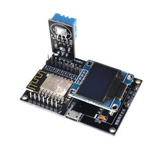

# MiniWeather

MiniWeather is a small Arduino project for a ESP8266 with a small OLED + DHL11 sensors. It shows the temperature in Celcius and the Humidity. Can also connect to a Wifi network and make the values available there.

Available from places like Banggood. Look for "Geekcreit ESP8266 IoT Development".

Was coded for fun and the challenge to use [PlatformIO](https://platformio.org).